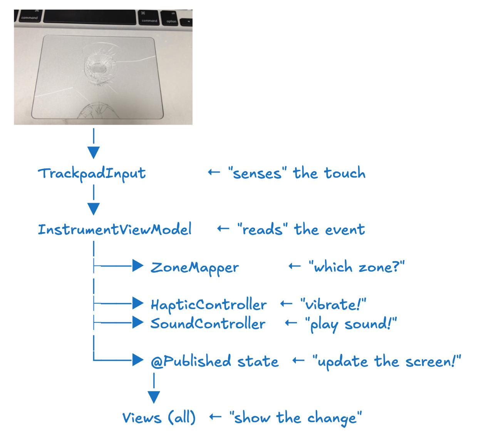
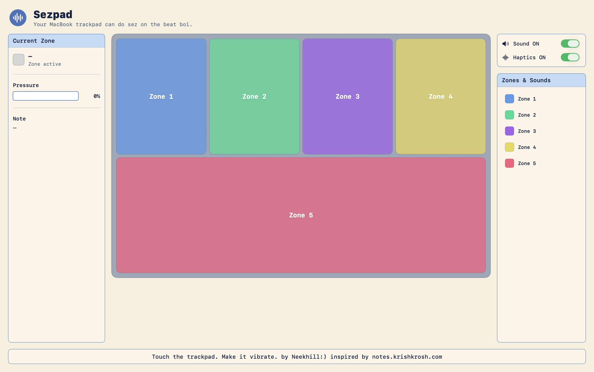

# [Sezpad] 🎯

## Basic Details
### Team Name: [Best in the Biz]

### Team Members
- Team Lead: [Nikhil S Krishnan] - [Toc H Institute of Science & Technology]
- Member 2: [⁠Mishal Biju] - [Toc H Institute of Science & Technology]

### Project Description
A macOS app that turns your MacBook trackpad and keyboard into a 5 zone MIDI style pad instrument. Every hit fires a haptic pulse, plays a sound, and lights up the zone on screen. Think of it as a MIDI pad but instead of buying an Akai MPD, you're using the trackpad you already have.

### The Problem (that doesn't exist)
My MacBook trackpad doesn't make music when I touch it.
Also: "I wish my $1,500 laptop was also a Fisher Price xylophone."

### The Solution (that nobody asked for)
Turn the trackpad into a 5-zone instrument. Press 1–5, use arrow keys, hit spacebar, or click-drag across the trackpad — each zone fires a different sound + haptic pulse. The screen lights up the zone you hit. It's over engineered on purpose. It's a love letter to MIDI controllers.

## Technical Details
### Technologies/Components Used
For Software:
- Languages used: Swift
- ⁠Frameworks used: SwiftUI, AppKit, AVFoundation, Combine
- Libraries used: NSEvent (input), NSHapticFeedbackManager (vibrations), AVAudioPlayer (sound)
- Tools used: Xcode 15+, macOS 13+

For Hardware:
- ⁠Main components: MacBook (built-in trackpad + Taptic Engine)
- Specifications: Works best on MacBooks with Force Touch trackpad (2015+)
- Tools required: None — no external hardware

### Implementation
For Software:

- From finger/keyboard input through the ViewModel to haptics, sound, and UI updates.

# Installation
git clone https://github.com/brokenspagheti/useless_project_temp.git
cd Sezpad.xcodeproj
open Sezpad.xcodeproj

# Run
In Xcode:
⌘R
Requirements: macOS 13+, Xcode 15+. No Apple Developer account needed.

### Project Documentation
For Software:

# Screenshots (Add at least 3)

*Full view of the dashboard*

*Haptic on/off and Sound on/off options on the right side of the dashboard*

*Pressures and other indicators on the left side of the dashboard*

*All "zones" assembled*

# Diagrams

*Full data flow — from finger/keyboard input through the ViewModel to haptics, sound, and UI updates.*

*Repo structure — Models (rulebook), Services (workers), ViewModels (manager), Views (dashboard).*

For Hardware:
Not applicable — no external hardware.

### Project Demo
# Video

*Short handcam video recording: tapping 1–5 in rhythm, watching zones light up with sound + haptics firing.*

## Team Contributions
- [Nikhil S Krishnan]: [Swift and Research]
- [Mishal Biju]: [design]

---
Made with ❤️ at TinkerHub Useless Projects 

