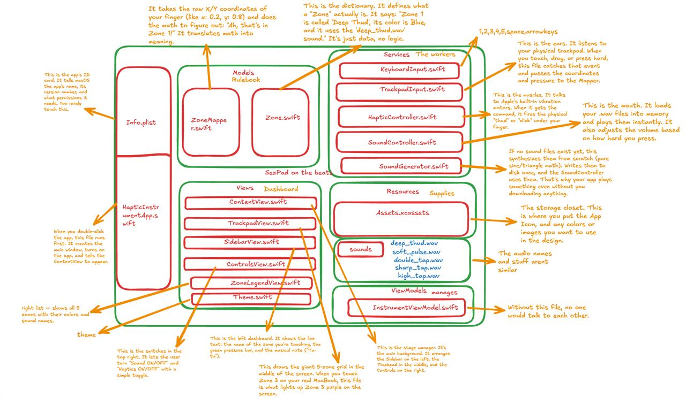
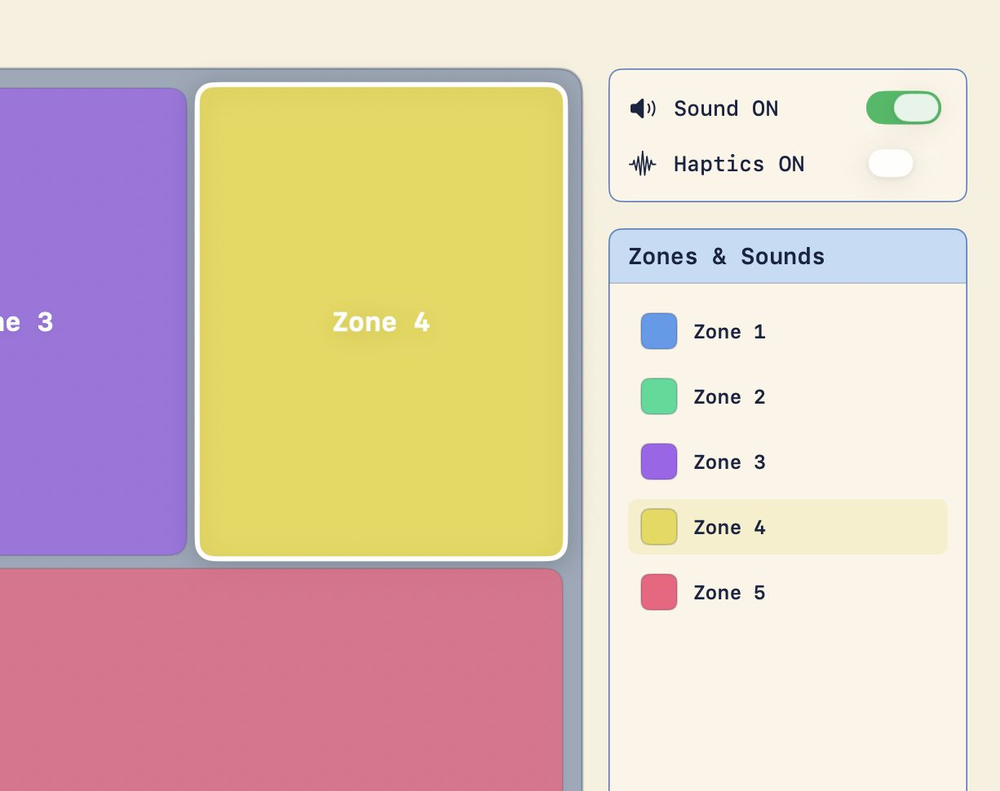
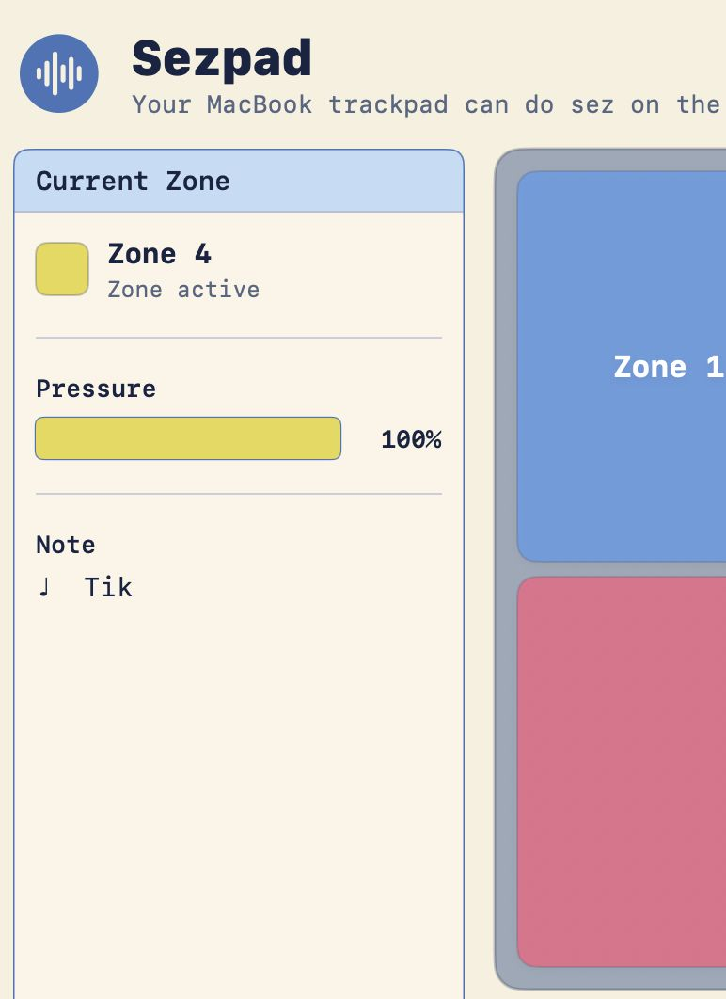
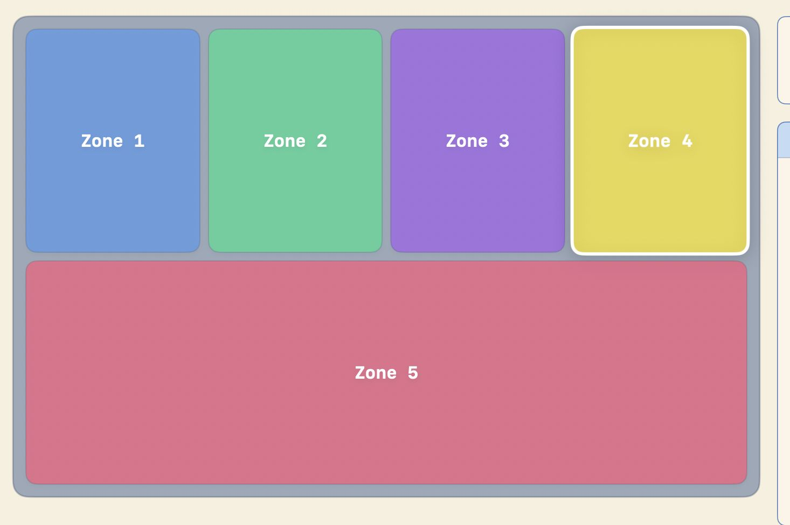

# Sezpad (Build Journal)

**Team:** Best in the Biz (Nikhil + Mishal)  
**Event:** TinkerHub Useless Projects, Sept 2026

---

## Why we even started this

So basically, I was watching this [Krish Shah video](https://www.youtube.com/watch?v=Q8bbXVRaYZk) where he's messing around with the MacBook trackpad as some kind of creative input device. And I'm sitting there thinking — wait, this thing can be an instrument no?

And the name **Sezpad** comes from *"Sez on the Beat"*. That was the first producer I actually knew by name when I started listening to DHH. Everyone knew the rapper, but Sez was the one whose name stuck in my head. So the whole thing is a small tribute to that.

---

## Hour 0: The Idea

> "What if my MacBook trackpad was a Fisher-Price xylophone for adults?"

That was it. That was the pitch. 5 zones, each one plays a sound, fires a haptic pulse, and lights up the screen. Useless? Yes. Beautiful? Also yes.

*The final build — 5 zones, sidebar with live pressure, Sound/Haptics toggles.*

---

## Hour 1: First wall — no raw trackpad data

**BUG:** Turns out macOS doesn't give raw finger coordinates to regular apps. Public API (`NSEvent`) only gives you the cursor position — not where your finger actually is on the trackpad.

Spent almost an hour reading about some private framework called `MultitouchSupport` that *does* give per-finger data. But then it needs Input Monitoring permission, keeps breaking on macOS updates, and Apple will never allow it on the App Store.

**PIVOT:** Okay fine, use cursor position as a proxy. Fullscreen mode, cursor becomes the finger. Not perfect, but it works.

*How a keypress or touch becomes sound + vibration + a lit-up zone.*

---

## Hour 3: The sandbox scene

**BUG:** "Where did my sounds go?" The app was supposed to write to `~/Library/Application Support/Sezpad/Sounds/`, but the folder was just not there. Terminal also saying "No such file or directory." Full tension.

An hour of digging later — turns out App Sandbox silently redirects everything to `~/Library/Containers/com.dev.instruuu.Sezpad/Data/...`. The folder was there only, just hiding inside some deep path we didn't know about.

**FIX:** Just bundle the sounds directly inside the app. No more Terminal, no more sandbox drama, done.

---

## Hour 6: The Xcode massacre

**BUG:** "Cannot find 'Zone' in scope." All 12 Swift files were compiling fine an hour back. Suddenly they can't see each other.

Files had somehow ended up in *Copy Bundle Resources* instead of *Compile Sources*. Basically Xcode was trying to ship our source code like it's some JPEG image.

**FIX:** Drag every `.swift` file back into Compile Sources. Rebuild. Sorted.

*Where everything lives — Models (rulebook), Services (workers), ViewModels (manager), Views (dashboard).*

---

## Hour 8: Adding the keyboard layer

The click-and-hold thing looks mad awkward on stage. You're dragging the cursor around hoping to hit the right zone while also trying to talk. Nobody's going to enjoy that. Thanks to the feedback from the TinkerHub college team members.

**FIX:** Added a keyboard layer. `1` through `5` trigger zones directly. `space`, `← ↑ → ↓` also work. Now you can drum on the keys like a MIDI pad, screen lights up, everything sings. Much better.

*Zone lighting up in real time as a key is pressed.*

*Sidebar showing the active zone, pressure bar, and note label.*

---

## Hour 11: The win

Tapped `1` `2` `3` `4` `5` in rhythm. Each zone lit up. Sound played. Haptic fired.

It was stupid. It was beautiful. Exactly what we promised.

*The final build, mid-performance.*

---

## Watch it in action

[▶ Watch the demo video](https://drive.google.com/file/d/1QVwFqLjDsw6G0fCajaDZ1Qn2xoeEmxol/view?usp=drivesdk)

*Short handcam recording — tapping 1–5 in rhythm, watching zones light up with sound + haptics firing.*

---

## What we learned

- macOS deliberately hides raw trackpad data behind a private framework — privacy by design, painful by accident.
- App Sandbox silently redirects file paths to `~/Library/Containers/`. Invisible until you go hunting for it.
- Xcode's Build Phases are not optional magic. You need to actually know which files go where, otherwise the whole project goes blind.
- Bundling assets inside the app is 10x easier than fighting the sandbox every single time.
- Keyboard input is just a better demo trigger than trackpad dragging. Nobody wants to watch someone drag a cursor around on stage.

---

## Who did what

- **Nikhil:** Swift, research, haptic + audio integration, README, docs.
- **Mishal:** UI design, Swift, testing, keeping the demo flow sensible.

---

*Built at TinkerHub Useless Projects, 2026.*  
*Inspired by [Krish Shah](https://www.youtube.com/watch?v=Q8bbXVRaYZk). Named after Sez on the Beat.*

**Turn the trackpad into a toy — that's the whole point.**
